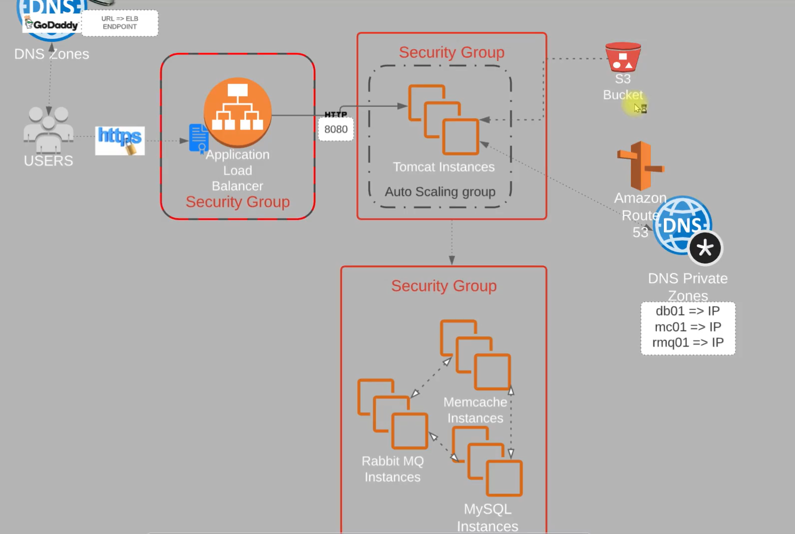

### Deploying a multi-tier application stack in AWS using EC2 instances 

## Repository URL - https://github.com/Mexxy-lab/Aws-multitierstack.git

- Stack is written in Java language, has 5 different services running on 5 different instances 

- We would be using the below infrastructure 

	- EC2 instances 		    | VMs for 4 services - Tomcat, MySQL, RabbitMQ, and Memcache services. 
	- Security Groups 		    | Used to manage the inbound and outbound traffics for all VMs or EC2 instances. We would have 3 security groups.  
	- Elastic Load balancers 	| Would replace the Nginx service 
	- Autoscaling service		| Would act as automation service for scaling our VMs or EC2 instances. Needed for cost control 
	- S3 and EFS 			    | Used for storage 
	- Route 53 			        | For DNS service and domain management

# Project Architecture 



## Project Flow: Manual Set up for better understanding of AWS services

1) Log into AWS console 
2) Create Key pairs used to log into EC2 

    - Created key pair using the .pem format since we would be accessing Instances using git bash / WSL. 

3) Create Security groups for Load Balancers, tomcat and backend services

    - Created 3 different security groups 
        - vprofile-ELB-SG - This is the security group for Elastic Load balancer. Allows TCP traffic from ports 80 and 443. HTTP and HTTP protocol respctively. Source is from anywhere (0.0.0.0/0)
        - vprofile-app-SG - This is the application level security group. Allows TCP traffic from port 8080 tomcat service and SSH protocol on port 22 for remote log in. Source is from ELB-SG.
        - vprofile-backend-SG - This is the SG for backend services allows traffic on ports 3306 - MySQL, 5672 - Rabbitmq and 11211 - Memcache. Source is from app SG. Port 22 for SSH remote connect

4) Launch instances with user-data (Bash scripts)

    - Created 4 VMs or EC2 instances for the 4 different services needed by the application. AMI used was the centos 9 OS and Ubuntu os. 
        - EC2 - vprofile-db01 - Mysql db service instance type -t2micro, add key pair to it and backend SG - vprofile-backend-SG. Also add the userdata script - mysql.sh. 
        - EC2 - vprofile-mco1 - Memcache service instance type - t2micro, add key pair to it and backend SG - vprofile-backend-SG. Also add the userdata script - memcache.sh 
        - EC2 - vprofile-rmq01 - Rabbitmq service instance type - t2micro, add key pair to it and backedn SG - vprofile-backend-SG. Also add the userdata script - rabbitmq.sh
        - EC2 - vprofile-app01 - Tomcat service instance type - t2micro, add key pair to it and application SG - vprofile-app-SG. Also add the userdata script - tomcat.sh

        - Connect to each VM using below command to verify services are running

        ```bash
        chmod 400 /home/pumej/Documents/vprofile-prod-key.pem
        ssh -i /home/pumej/Documents/vprofile-prod-key.pem ec2-user@ec2-3-85-142-225.compute-1.amazonaws.com 

        ssh-keygen -f "/home/pumej/.ssh/known_hosts" -R "34.227.116.104"                | Used to readd your key after rebooting your VM

        ss -tunlp | grep 11211                              | This would find the service running on that port number 

        TOKEN=$(curl -X PUT "http://169.254.169.254/latest/api/token" \
        -H "X-aws-ec2-metadata-token-ttl-seconds: 21600")

        curl -H "X-aws-ec2-metadata-token: $TOKEN" \
        http://169.254.169.254/latest/user-data                     | Used to retrieve user-data

        sudo cat /var/log/cloud-init-output.log                     | Used to trace the script for errors

        sudo truncate -s 0 /var/log/cloud-init-output.log           | Used for cleaing up the init log file 
        sudo truncate -s 0 /var/log/cloud-init.log
        sudo cloud-init clean --logs
        sudo reboot                                                 | This would re-run the user-data script on start up.
        ```
5) Update IP addresses to name mapping in route 53. (Create a private hosted zone and Simple record for each VM and assign the private IP to the records)
    - Also update the application config file properties with the new hosted name we created for each VM.

6) Build Application locally from source code 
    - Run below commands to build the artifacts 
    ```bash
    mvn install
    sudo update-alternatives --config java                  | Used to switch java version 
    ```
7) Upload to S3 bucket 

    - Create an S3 bucket using below command and copy to the created bucket: 
    ```bash
    aws s3 mb s3://pumejcoder-multitierapp                                      | Used to create the bucket 
    aws s3 cp target/vprofile-v2.war s3://pumejcoder-multitierapp/              | Used to copy the files to s3 bucket 
    ```
8) Download artifact to EC2 instance where you have tomcat running 

    - SSH into the vprofile-app01 tomcat instance and download files from S3 bucket to the ROOT directory
        ```bash
        aws s3 cp s3://pumejcoder-multitierapp/vprofile-v2.war /tmp/
        ```
    - Stop the tomcat service 
    - Remove the tomcat9 default ROOT directory or folder in var/lib/tomcat9/webapps/ROOT
    ```bash
    systemctl stop tomcat9
    rm -rf /var/lib/tomcat9/webapps/ROOT                        | rm -rf /var/lib/tomcat10/webapps/ROOT/ # if you used tomcat10 service.
    cp /tmp/vprofile-v2.war /var/lib/tomcat9/webapps/ROOT.war
    systemctl start tomcat10
    ```
9) Set up the Elastic Loadbalancers with HTTPS cert from ACM

    - First create a Target group - This is the group you want your loadbalancer to route traffic to.
        - vprofile-app-TG open port 8080 for the tomcat application service. Also set the healtchecks and unhealthy threshold.
        - Create the ELB and attach the target group created, also update the security group ELB SG. 

10) Create the Autoscaling group 

    - First create the image instance 
11) Verify the infra set up 
12) Build Autoscaling Group for Tomcat Instances.


